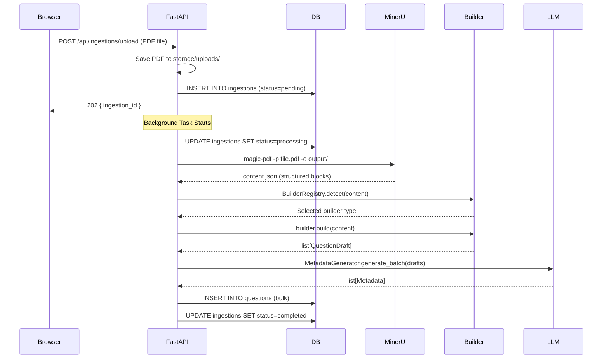
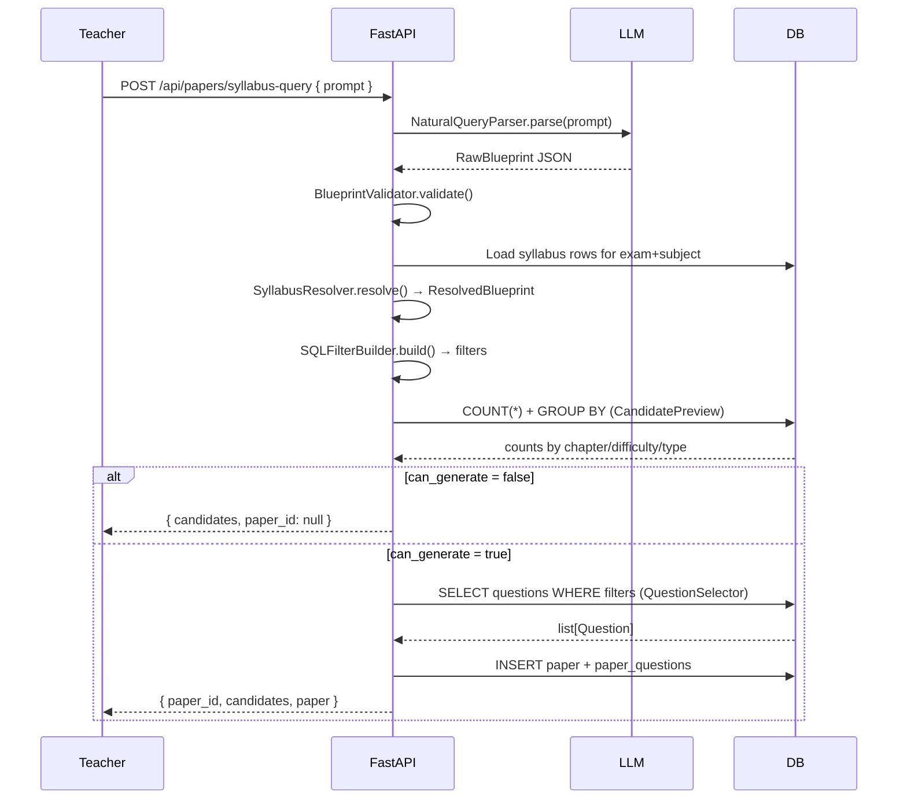
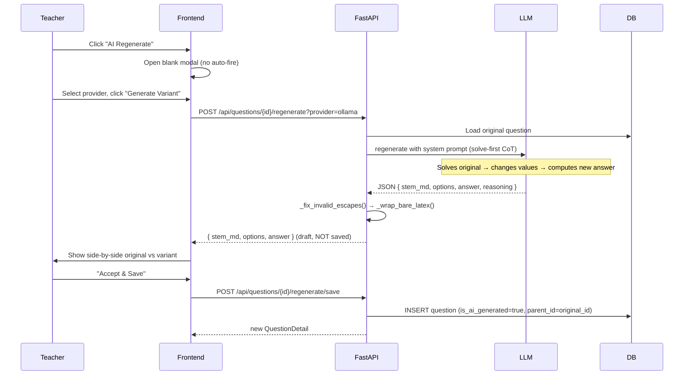

# MockTest Question Bank System
## Complete Technical Engineering Handbook

> **Audience:** Backend and full-stack engineers joining the project.
> **Prerequisites:** Working knowledge of Python, FastAPI, SQLAlchemy, React.
> **Purpose:** Teach the reasoning behind every decision, not just describe what the code does.

---

## Table of Contents

1. [High-Level Overview](#part-1)
2. [Overall Architecture](#part-2)
3. [Folder Structure](#part-3)
4. [Every Important File](#part-4)
5. [Data Flows](#part-5)
6. [Database Schema](#part-6)
7. [Question Builders](#part-7)
8. [AI Components](#part-8)
9. [Frontend](#part-9)
10. [API Documentation](#part-10)
11. [Design Decisions](#part-11)
12. [End-to-End Walkthroughs](#part-12)
13. [Code Reading Guide](#part-13)
14. [Hidden Engineering Decisions](#part-14)
15. [Weaknesses and Technical Debt](#part-15)
16. [Interview Preparation](#part-16)
17. [Architecture Summary Diagrams](#part-17)

---

# PART 1 — High-Level Overview {#part-1}

## 1.1 What Problem This Solves

Indian competitive exam coaching institutions (JEE, NEET, CUET) run on question banks. Teachers source questions from published papers, print books, and proprietary PDFs. The problems they face:

1. **Questions are trapped in PDFs.** No searchability, no filtering by chapter or difficulty.
2. **Building tests is manual.** Teachers manually copy-paste 30–90 questions per test paper.
3. **No provenance.** Questions lose their source context when copied into Word documents.
4. **No variant generation.** Each question is used once and then wasted.
5. **Syllabus boundaries are hard to enforce.** "Chapter 1 to 5 only" requires memory.

This system solves all five by building a structured, searchable question bank from raw PDFs with a natural language interface for paper generation.

## 1.2 What It Does

At a high level the system:

1. **Ingests PDF files** → extracts structured questions (stem, options, answer) with provenance
2. **Classifies every question** using an LLM → chapter, difficulty, subtopic, type
3. **Stores everything** in PostgreSQL with rich metadata
4. **Accepts natural language queries** → "Give me 30 JEE physics questions up to Rotational Motion, 10 easy 15 medium 5 hard"
5. **Generates draft papers** that teachers review question-by-question
6. **Allows AI regeneration** of individual questions with different numerical values
7. **Exports** to Markdown or printable HTML

## 1.3 Architecture Philosophy

### Local-First

The entire system runs on a teacher's laptop. No cloud subscription, no per-call fees, no data leaving the institution. Ollama provides local LLM inference. PostgreSQL runs locally. MinerU runs locally for PDF parsing.

**Why?** Schools in India often have unreliable internet. More importantly, exam questions are proprietary and legally sensitive. Teachers won't trust a cloud service with unpublished exam content.

### Deterministic Core, AI at the Edges

```
PDF → [MinerU] → [Question Builders] → PostgreSQL
                  ↑ DETERMINISTIC
                                    ↓
                              [Metadata LLM]
                              [Query Parser LLM]
                              [Regeneration LLM]
                              ↑ AI (small, bounded, fallible)
```

The ingestion pipeline — the part that actually extracts questions from PDFs — is **entirely deterministic regex + rule-based parsing**. There is no LLM in the ingestion loop.

**Why?** Deterministic parsing:
- Is auditable: you can trace exactly why a question was extracted
- Never hallucinates an answer
- Is fast (milliseconds vs seconds)
- Never corrupts a question's answer key
- Is reproducible: same PDF always produces same questions

LLMs are only used where human judgment is mimicked:
- Classifying what chapter a question belongs to
- Understanding a teacher's natural language request
- Generating a numerically-varied question

### Separation of Concerns (Hard Boundary)

The system enforces a strict boundary: **extraction is separate from classification**. A question is extracted first (deterministically), then classified second (with LLM). This means if classification fails, the question is still saved — just with empty metadata. It won't be lost.

## 1.4 Current Capabilities

| Capability | Status |
|---|---|
| PDF ingestion (text-based) | ✅ Production |
| PDF ingestion (scanned) | ✅ via MinerU OCR |
| Question extraction | ✅ 4 layout types |
| AI metadata tagging | ✅ Ollama/Groq |
| Natural language paper generation | ✅ |
| Question regeneration | ✅ |
| Teacher review workflow | ✅ |
| Print/Markdown export | ✅ |
| Syllabus management | ✅ JEE/NEET/CUET |
| Embeddings / semantic search | ❌ Not implemented |
| Student-facing interface | ❌ Admin only |
| Multi-user / auth | ❌ Single teacher |

## 1.5 Future Vision

- Semantic deduplication (embeddings to detect near-duplicate questions)
- Student-facing test delivery interface
- Performance analytics by chapter/difficulty
- Multi-teacher collaboration with role-based access
- Vector search for "find similar questions to this one"
- Automated difficulty calibration based on student performance

---

# PART 2 — Overall Architecture {#part-2}

## 2.1 System Architecture Diagram

```
┌─────────────────────────────────────────────────────┐
│                   TEACHER'S BROWSER                 │
│              React + Vite (port 5173)               │
│                                                     │
│  ┌──────────┐ ┌──────────┐ ┌──────────────────────┐ │
│  │ Upload   │ │ TestView │ │   PaperGenerator     │ │
│  │ PDF page │ │ (Q bank) │ │   + PaperDraft       │ │
│  └────┬─────┘ └────┬─────┘ └──────────┬───────────┘ │
└───────┼────────────┼──────────────────┼─────────────┘
        │            │                  │
        │    axios (HTTP/JSON)           │
        │            │                  │
┌───────▼────────────▼──────────────────▼─────────────┐
│                 FastAPI (port 8000)                  │
│                  app/main.py                         │
│                                                     │
│  ┌─────────┐ ┌──────────┐ ┌─────────┐ ┌──────────┐  │
│  │/api/    │ │/api/     │ │/api/    │ │/api/     │  │
│  │ingestion│ │questions │ │papers   │ │syllabus  │  │
│  └────┬────┘ └────┬─────┘ └────┬────┘ └────┬─────┘  │
└───────┼───────────┼────────────┼────────────┼────────┘
        │           │            │            │
┌───────▼───────────▼────────────▼────────────▼────────┐
│                    SERVICES LAYER                    │
│                                                     │
│  ┌─────────────────┐  ┌──────────────────────────┐   │
│  │IngestionPipeline│  │  NaturalQueryPipeline     │   │
│  │  (orchestrator) │  │  (6-stage orchestrator)   │   │
│  └────────┬────────┘  └──────────┬───────────────┘   │
│           │                      │                   │
│  ┌────────▼────────┐  ┌──────────▼───────────────┐   │
│  │   MinerU Runner │  │  SyllabusResolver         │   │
│  │  (PDF → JSON)   │  │  SQLFilterBuilder         │   │
│  └────────┬────────┘  │  CandidatePreview         │   │
│           │           │  QuestionSelector          │   │
│  ┌────────▼────────┐  └──────────────────────────┘   │
│  │ QuestionBuilder │                                  │
│  │    Registry     │  ┌──────────────────────────┐   │
│  │ (4 builders)    │  │   LLM Abstraction Layer   │   │
│  └────────┬────────┘  │  ┌──────────┐ ┌────────┐ │   │
│           │           │  │  Ollama  │ │  Groq  │ │   │
│  ┌────────▼────────┐  │  └──────────┘ └────────┘ │   │
│  │MetadataGenerator│  └──────────────────────────┘   │
│  │  (LLM tagging)  │                                  │
│  └────────┬────────┘  ┌──────────────────────────┐   │
│           │           │  QuestionRegenerator      │   │
│           │           │  (LLM-based variant gen)  │   │
└───────────┼───────────┴──────────────────────────────┘
            │
┌───────────▼────────────────────────────────────────┐
│                    POSTGRESQL                       │
│                                                     │
│  questions  ingestions  papers  paper_questions     │
│  syllabus                                           │
└─────────────────────────────────────────────────────┘
```

## 2.2 Why Each Layer Exists

### Frontend Layer
React with Vite provides a SPA for the teacher. It is completely decoupled from the backend via HTTP — this means the frontend can be replaced entirely (e.g., with a mobile app) without touching the API.

### FastAPI Layer
FastAPI is the thin HTTP interface. Its job is only:
- Route HTTP requests to the correct service
- Validate request bodies (via Pydantic schemas)
- Serialize responses
- Handle HTTP errors

**FastAPI does NOT contain business logic.** All logic is in services.

### Services Layer
Each service has one responsibility. `IngestionPipeline` orchestrates ingestion. `NaturalQueryPipeline` orchestrates paper generation. This allows each service to be tested independently and replaced without affecting others.

### LLM Abstraction Layer
A dedicated `services/llm/` package hides all LLM provider details behind a common interface. The rest of the system calls `get_llm_client()` and calls `.generate_json()`. It never knows if it's talking to Ollama or Groq.

### PostgreSQL
Single relational database. All state lives here. Alembic manages migrations. SQLAlchemy provides the ORM.

## 2.3 Request Lifecycle (PDF Upload)

```
Browser POST /api/ingestions/upload (multipart)
  → FastAPI saves PDF to storage/uploads/
  → Creates Ingestion record (status=pending)
  → Returns ingestion_id immediately (202 Accepted)
  → Background task starts:
      IngestionPipeline.run(ingestion_id, db)
        → MinerU.run(pdf_path) → content.json
        → BuilderRegistry.detect(content) → select builder
        → builder.build(content) → list[QuestionDraft]
        → MetadataGenerator.generate_batch(drafts) → list[Metadata]
        → Save all Questions to DB
        → Update Ingestion status=completed
```

---

# PART 3 — Folder Structure {#part-3}

```
mocktest/
├── app/                          # Python backend (FastAPI)
│   ├── main.py                   # App factory + router registration
│   ├── config.py                 # All settings (env vars via pydantic-settings)
│   ├── database.py               # SQLAlchemy engine + session factory
│   ├── models/                   # SQLAlchemy ORM models (DB tables)
│   │   ├── question.py           # Question, Image
│   │   ├── ingestion.py          # Ingestion
│   │   ├── paper.py              # Paper, PaperQuestion
│   │   └── syllabus.py           # Syllabus
│   ├── schemas/                  # Pydantic request/response models
│   │   ├── question.py           # QuestionOut, QuestionDetail, etc.
│   │   ├── ingestion.py          # IngestionOut, IngestionCreate, etc.
│   │   └── paper.py              # PaperOut, PaperQuestionItem, etc.
│   ├── api/                      # HTTP route handlers (thin controllers)
│   │   ├── __init__.py           # Router aggregator
│   │   ├── ingestion.py          # /api/ingestions/*
│   │   ├── questions.py          # /api/questions/*
│   │   ├── papers.py             # /api/papers/*
│   │   ├── natural_query.py      # /api/papers/syllabus-query
│   │   └── syllabus.py           # /api/syllabus/*
│   ├── services/                 # All business logic
│   │   ├── ingestion_pipeline.py # Top-level ingestion orchestrator
│   │   ├── mineru_runner.py      # MinerU subprocess wrapper
│   │   ├── metadata_generator.py # LLM-based question tagging
│   │   ├── post_processor.py     # Cleanup before saving to DB
│   │   ├── paper_generator.py    # Paper draft creation
│   │   ├── question_selector.py  # Seeded, distribution-aware selection
│   │   ├── question_regenerator.py # LLM-based question variant generation
│   │   ├── syllabus_data.py      # Hardcoded syllabus structure (large file)
│   │   ├── question_builder/     # Layout-specific question extraction
│   │   │   ├── abstract_builder.py   # ABC definition
│   │   │   ├── base.py               # Shared parsing utilities
│   │   │   ├── registry.py           # Auto-detection + dispatch
│   │   │   ├── full_paper.py         # Layout: Q + options + answer on same page
│   │   │   ├── inline_answer.py      # Layout: answer inline after question
│   │   │   ├── separate_answer_key.py # Layout: answers in separate section
│   │   │   └── with_solution.py      # Layout: full solution included
│   │   ├── llm/                  # LLM provider abstraction
│   │   │   ├── base.py               # AbstractLLMClient ABC
│   │   │   ├── ollama_client.py      # Local Ollama implementation
│   │   │   ├── groq_client.py        # Groq cloud implementation
│   │   │   ├── qwen_client.py        # Alternative local implementation
│   │   │   └── __init__.py           # get_llm_client() factory
│   │   └── natural_query/        # Natural language → paper pipeline
│   │       ├── pipeline.py           # 6-stage orchestrator
│   │       ├── parser.py             # Stage 1: LLM → RawBlueprint
│   │       ├── validator.py          # Stage 2: validation
│   │       ├── resolver.py           # Stage 3: chapter name resolution
│   │       ├── filter_builder.py     # Stage 4: SQL filter construction
│   │       ├── candidate_preview.py  # Stage 5: count + sample query
│   │       ├── selector.py           # Stage 6: final selection
│   │       ├── schemas.py            # RawBlueprint → ValidatedBlueprint → ResolvedBlueprint
│   │       ├── exceptions.py         # Custom exception hierarchy
│   │       └── __init__.py
│   └── constants/                # Shared constant values
│       └── exams.py              # Exam name + subject normalizers
├── alembic/                      # Database migrations
│   ├── env.py                    # Migration runner config
│   └── versions/                 # Auto-generated migration scripts
├── admin-panel/                  # React frontend
│   ├── src/
│   │   ├── main.tsx              # Entry point
│   │   ├── App.tsx               # Router definition
│   │   ├── api/                  # Axios API clients
│   │   │   ├── client.ts         # Axios instance (base URL, timeout)
│   │   │   ├── ingestion.ts      # Ingestion endpoints
│   │   │   ├── questions.ts      # Question endpoints
│   │   │   └── papers.ts         # Paper endpoints
│   │   ├── types/                # TypeScript type definitions
│   │   │   ├── question.ts
│   │   │   ├── ingestion.ts
│   │   │   └── paper.ts
│   │   ├── pages/                # One component per route
│   │   │   ├── Dashboard.tsx     # Stats overview
│   │   │   ├── UploadPdf.tsx     # PDF upload form
│   │   │   ├── Ingestions.tsx    # List of uploads
│   │   │   ├── IngestionDetail.tsx # Per-upload review
│   │   │   ├── QuestionBank.tsx  # Searchable question list
│   │   │   ├── QuestionDetail.tsx # Single question view
│   │   │   ├── TestView.tsx      # Interactive test simulator
│   │   │   ├── PaperGenerator.tsx # Natural language paper generation
│   │   │   ├── PaperDraft.tsx    # Paper review workflow
│   │   │   └── ApiDebug.tsx      # Debug endpoint testing
│   │   ├── components/           # Reusable components
│   │   │   ├── layout/           # Sidebar, navbar
│   │   │   ├── question/         # RenderedContent (LaTeX), QuestionCard
│   │   │   └── ui/               # Generic UI primitives
│   │   └── constants/            # Frontend constants
│   └── vite.config.ts            # Vite + proxy config
├── storage/                      # File storage (local filesystem)
│   ├── uploads/                  # Raw uploaded PDFs
│   ├── mineru_output/            # MinerU-parsed JSON files
│   └── images/                   # Extracted question diagram images
├── scripts/                      # Utility scripts (seed, migrate, etc.)
├── tests/                        # Pytest tests
├── docs/                         # Documentation
├── pyproject.toml                # Python package + dependencies
└── .env                          # Environment variables (not committed)
```

### What Should NEVER Live in `api/`
- Database queries (use services)
- Business logic (use services)
- LLM calls (use LLM layer)
- File system operations (use services)

### What Should NEVER Live in `services/`
- HTTP status codes
- Request/response serialization
- FastAPI dependencies

### What Should NEVER Live in `models/`
- Business logic
- Validation beyond DB-level constraints
- Anything a service needs to know about HTTP

---

# PART 4 — Every Important File {#part-4}

## 4.1 `app/main.py`

**Purpose:** Application factory. Creates the FastAPI app, registers all routers, configures CORS, serves static files for question images, and starts the lifespan event handler.

**Key Decisions:**
- Uses `lifespan` context manager (not deprecated `on_event`) for startup/shutdown
- Mounts `/api/images` as a static directory so question images can be served without a dedicated endpoint
- All API routes live under `/api` prefix
- CORS allows all origins in development (should be restricted in production)

**Who calls it:** `uvicorn app.main:app` — the ASGI server loads this

**Dependencies:** All API routers, config, database

```python
# Simplified structure
app = FastAPI(lifespan=lifespan)
app.add_middleware(CORSMiddleware, allow_origins=["*"])
app.mount("/api/images", StaticFiles(directory=settings.storage_images_path))
app.include_router(ingestion_router, prefix="/api")
app.include_router(questions_router, prefix="/api")
app.include_router(papers_router, prefix="/api")
app.include_router(syllabus_router, prefix="/api")
```

---

## 4.2 `app/config.py`

**Purpose:** Single source of truth for all configuration. Uses Pydantic Settings (`BaseSettings`) so every value can be overridden by an environment variable or `.env` file.

**Key Fields:**

| Field | Purpose | Default |
|---|---|---|
| `database_url` | PostgreSQL connection string | required |
| `storage_path` | Root directory for file storage | `./storage` |
| `ollama_base_url` | Ollama server URL | `http://localhost:11434` |
| `ollama_model` | Which local model to use for metadata | `qwen2.5:7b` |
| `groq_api_key` | Groq cloud API key | optional |
| `groq_model` | Groq model name | `llama-3.1-8b-instant` |
| `regen_ollama_model` | Model used for regeneration | `qwen2.5:7b` |
| `regen_groq_model` | Groq model for regeneration | `llama-3.1-8b-instant` |
| `mineru_enabled` | Whether to use MinerU | `true` |

**Design Pattern:** Every service accesses settings via `from app.config import settings`. This is a module-level singleton. There is only one instance per process. This is a deliberate choice — not FastAPI's dependency injection — because settings don't need to be swapped per-request.

**Why Pydantic Settings?**
- Type-safe: `database_url: str` not `os.getenv("DATABASE_URL")`
- Validates on startup: typos in env vars fail immediately
- `.env` file support with zero boilerplate
- Computed properties: `storage_uploads_path` = `storage_path / "uploads"`

---

## 4.3 `app/database.py`

**Purpose:** Creates the SQLAlchemy engine and session factory. Provides `get_db()` — a FastAPI dependency that yields a DB session per request.

```python
engine = create_engine(settings.database_url)
SessionLocal = sessionmaker(autocommit=False, autoflush=False, bind=engine)

def get_db():
    db = SessionLocal()
    try:
        yield db
    finally:
        db.close()
```

**Why `autoflush=False`?**
SQLAlchemy's default `autoflush=True` would flush pending changes before every query. In a service that builds complex objects across multiple helper functions before committing, this can cause premature writes or integrity errors. `autoflush=False` gives us explicit control.

**Why `autocommit=False`?**
Every request runs in a transaction. If an exception occurs mid-way (e.g., metadata generation fails), the session is closed without committing, so no partial data is persisted.

**Transaction Scope:** The session is scoped to the HTTP request via FastAPI's `Depends(get_db)`. Each request gets a fresh session. This is the correct pattern for web applications — it prevents connection leaks and ensures isolation between requests.

---

## 4.4 `app/models/question.py`

**Purpose:** Defines the `Question` SQLAlchemy model (maps to the `questions` table) and `Image` model.

**Key Fields and Their Reasons:**

| Column | Type | Why |
|---|---|---|
| `id` | UUID | Globally unique, safe for URLs, no sequential guessing |
| `stem_md` | Text | LaTeX-formatted question text in Markdown |
| `raw_text` | Text | Plain text of the question (pre-formatting) for search previews |
| `options` | JSONB | MCQ options are variable count (A/B/C/D/E). JSONB allows querying into the dict |
| `answer` | String | For MCQ: option key (e.g., "A"). For integer: the numeric answer |
| `section_type` | String | "mcq" or "integer" — drives rendering and scoring logic |
| `question_type` | String | "conceptual", "numerical", etc. |
| `chapter` | String | Resolved chapter name from syllabus |
| `difficulty` | String | "easy", "medium", "hard" |
| `has_formula` | Boolean | Enables formula-based filtering |
| `has_diagram` | Boolean | Enables diagram-based filtering |
| `concepts` | JSONB | Array of concept strings for semantic filtering |
| `exam_name` | String | "JEE Main", "NEET", "CUET" |
| `subject` | String | Normalized: "physics", "chemistry", etc. |
| `status` | String | "active" or "deleted" (soft delete) |
| `ingestion_id` | FK | Links question back to the PDF it came from |
| `question_number` | Integer | Position within the original PDF |
| `source_page` | Integer | Page number in original PDF (for provenance) |
| `is_ai_generated` | Boolean | True if created via LLM regeneration |
| `parent_question_id` | FK (self) | Links regenerated question to its original |

**Why JSONB for `options` and `concepts`?**
- `options`: The number of options varies (3, 4, or 5). Storing as JSONB `{"A": "...", "B": "...", "C": "...", "D": "..."}` avoids sparse columns and allows querying specific options. The alternative (separate `Option` table with FK) would require a JOIN on every question fetch.
- `concepts`: A question might have 0–10 concepts. JSONB arrays support PostgreSQL's `@>` containment operator, enabling efficient `WHERE concepts @> '["Newton's law"]'` queries.

**Why UUID as primary key?**
- Safe for distributed systems (no coordination needed for ID generation)
- Not guessable (security: can't enumerate questions by incrementing an integer)
- Works well with URL paths: `/api/questions/7f3c2a1d-...`

**The `Image` Model:**
Images are extracted from PDFs (diagrams, figures). The `Image` model has `question_id` (FK), `filename` (where it's stored in `storage/images/`), and `position` ("stem" or "solution"). Images are served via the static file mount at `/api/images/{filename}`.

---

## 4.5 `app/models/ingestion.py`

**Purpose:** Tracks a PDF upload through its processing lifecycle.

**Key Fields:**

| Column | Type | Why |
|---|---|---|
| `id` | UUID | Primary key |
| `filename` | String | Original filename for display |
| `file_path` | String | Absolute path to the PDF on disk |
| `status` | String | "pending" → "processing" → "completed" / "failed" |
| `exam_name` | String | Teacher-specified at upload time |
| `subject` | String | Teacher-specified at upload time |
| `total_questions` | Integer | How many questions were extracted |
| `failed_questions` | Integer | How many extraction attempts failed |
| `error_message` | Text | Failure reason (for "failed" status) |
| `layout_type` | String | Which builder was selected |
| `processing_started_at` | DateTime | When background processing began |
| `processing_completed_at` | DateTime | When it finished |

**Lifecycle:** The ingestion record exists before MinerU runs. This allows the teacher to see "in progress" status immediately after upload rather than waiting several minutes.

---

## 4.6 `app/models/paper.py`

**Purpose:** Defines `Paper` and `PaperQuestion` — the draft paper entities.

**`Paper` fields:**

| Column | Type | Why |
|---|---|---|
| `id` | UUID | Primary key |
| `prompt` | Text | The original natural language query that created this paper |
| `status` | String | "draft" → "approved" |
| `blueprint` | JSONB | The complete parsed blueprint (all parameters) |

**`PaperQuestion` fields:**

| Column | Type | Why |
|---|---|---|
| `id` | UUID | Primary key |
| `paper_id` | FK | Which paper |
| `question_id` | FK | Which question |
| `position` | Integer | Order in the paper |
| `display_number` | Integer | Question number shown to students |
| `paper_section` | String | "Section A", "Section B", etc. |
| `locked` | Boolean | Teacher approved this question |

**Why a join table (PaperQuestion) instead of a JSON array?**
The join table (`paper_questions`) allows:
- Individual question approval (lock/unlock per question)
- Swapping a question (change `question_id`)
- Reordering questions (update `position`)
- Maintaining full question history even after paper approval

If questions were stored as a JSON array in `Paper`, we'd lose all these capabilities.

---

## 4.7 `app/models/syllabus.py`

**Purpose:** Stores the official chapter ordering for each exam+subject combination.

**Key Fields:**

| Column | Type | Why |
|---|---|---|
| `exam_name` | String | "JEE Main", "NEET", etc. |
| `subject` | String | "physics", "chemistry", etc. |
| `chapter_name` | String | Official canonical name |
| `chapter_order` | Integer | Position in syllabus (1-indexed) |
| `chapter_aliases` | JSONB | Alternative names ("Kinematics" = ["kinematics", "motion in 1D"]) |

**Why store syllabus in DB?** Because the `SyllabusResolver` (Stage 3 of the natural query pipeline) needs to look up chapters by exam+subject. Hardcoding in Python would make it impossible to add new exams without redeploying. The DB allows runtime management.

**Why `chapter_aliases` as JSONB?** Teachers and LLMs both use colloquial names. "Rotational Motion" might be asked as "rotation", "rotational mechanics", "rigid body". The aliases column makes the resolver robust to name variation without requiring exact canonical names from the LLM.

---

## 4.8 `app/schemas/question.py`

**Purpose:** Pydantic models for the HTTP request/response layer. Completely separate from ORM models.

**Key Models:**

- `QuestionOut` — lightweight list response (id, chapter, difficulty, question_type, stem preview)
- `QuestionDetail` — full response with all fields including options, answer, images
- `QuestionFilters` — query parameters for the question list endpoint
- `RegenerateDraft` — what the regeneration endpoint returns (stem_md, options, answer, provider_used)
- `RegenerateSaveData` — what the save endpoint accepts

**Why Separate from ORM Models?**
This is a critical design principle. The ORM model is the database representation. The Pydantic schema is the API contract. They are intentionally different:
- The ORM model has `ingestion_id`, `file_path`, `raw_text` — internal details the API never exposes
- The Pydantic schema can compute derived fields (e.g., `has_images` from the images list)
- You can change the DB schema without breaking the API contract and vice versa

---

## 4.9 `app/api/ingestion.py`

**Purpose:** HTTP handlers for the ingestion lifecycle.

**Endpoints:**

| Method | Path | What it does |
|---|---|---|
| POST | `/api/ingestions/upload` | Accept PDF, start background processing |
| GET | `/api/ingestions` | List all ingestions with status |
| GET | `/api/ingestions/{id}` | Get single ingestion + its questions |
| DELETE | `/api/ingestions/{id}` | Delete ingestion + cascade delete questions |

**Key Pattern — Background Task:**
```python
@router.post("/ingestions/upload")
async def upload_pdf(
    background_tasks: BackgroundTasks,
    file: UploadFile,
    db: Session = Depends(get_db),
):
    # Save PDF, create Ingestion record (status=pending)
    ingestion = create_ingestion_record(...)
    db.commit()

    # Return IMMEDIATELY — don't make teacher wait
    background_tasks.add_task(run_pipeline, ingestion.id)
    return IngestionOut.from_orm(ingestion)  # 202 response
```

This is important: the teacher gets a response within milliseconds. The actual PDF processing (which can take 2-10 minutes for a large PDF) runs in the background.

**Why not use Celery?** Celery requires Redis or RabbitMQ as a broker — additional infrastructure the teacher would need to run. FastAPI's `BackgroundTasks` runs in the same process, which is sufficient for single-user local deployment. The tradeoff: if the server restarts during processing, the task is lost. This is acceptable for V1.

---

## 4.10 `app/api/questions.py`

**Purpose:** HTTP handlers for question CRUD and the regeneration workflow.

**Endpoints:**

| Method | Path | What it does |
|---|---|---|
| GET | `/api/questions` | List with filters (chapter, difficulty, type, etc.) |
| GET | `/api/questions/{id}` | Get single question detail |
| DELETE | `/api/questions/{id}` | Soft delete (status → "deleted") |
| POST | `/api/questions/{id}/regenerate` | Generate AI variant (returns draft, does NOT save) |
| POST | `/api/questions/{id}/regenerate/save` | Save the draft as a new question |

**Why Two-Step Regeneration?**
The regeneration workflow is intentionally split into two requests:
1. `POST /regenerate` → returns a draft for teacher review
2. `POST /regenerate/save` → saves it only after teacher approves

This prevents automatic saving of potentially wrong AI output. The teacher must actively click "Accept & Save".

**Soft Delete vs Hard Delete:**
Questions are never hard-deleted. `DELETE /api/questions/{id}` sets `status = "deleted"`. This means:
- Questions in existing papers still have valid foreign keys
- Deleted questions can be recovered if needed
- Audit trail is preserved

---

## 4.11 `app/api/papers.py`

**Purpose:** Paper CRUD, per-question actions (lock/swap/remove), and alternatives.

**Endpoints:**

| Method | Path | What it does |
|---|---|---|
| GET | `/api/papers` | List papers |
| GET | `/api/papers/{id}` | Get full paper with questions |
| POST | `/api/papers/{id}/approve` | Approve paper (status → "approved") |
| PATCH | `/api/papers/{id}/questions/{pqId}/lock` | Toggle question approval |
| PATCH | `/api/papers/{id}/questions/{pqId}` | Swap question (change question_id) |
| DELETE | `/api/papers/{id}/questions/{pqId}` | Remove question from paper |
| GET | `/api/papers/{id}/questions/{pqId}/alternatives` | Find swappable alternatives |
| GET | `/api/papers/{id}/export` | Export to Markdown |

**The Alternatives Endpoint:**
When a teacher wants to swap a question, the `/alternatives` endpoint finds other questions with matching `chapter`, `difficulty`, and `section_type` that are NOT already in the paper. This gives the teacher a curated list of drop-in replacements.

---

## 4.12 `app/services/ingestion_pipeline.py`

**Purpose:** Orchestrates the full PDF-to-database pipeline. This is the most complex service.

**Why it exists:** Without an orchestrator, the pipeline would be scattered across the API handler. The orchestrator owns the lifecycle: it creates the MinerU output directory, calls MinerU, calls the builder registry, calls the metadata generator, and saves everything to DB. If any step fails, it updates the Ingestion record with the error.

**The Pipeline Steps:**

```
1. Update ingestion.status = "processing"
2. Run MinerU on the PDF → content.json
3. Registry detects layout type
4. Selected builder extracts questions → list[QuestionDraft]
5. Post-processor cleans drafts (strip whitespace, fix option keys, etc.)
6. MetadataGenerator.generate_batch(drafts) → list[Metadata] (LLM call)
7. Merge metadata into drafts
8. Save all Question objects to DB (bulk insert)
9. Update ingestion.status = "completed", total_questions = N
```

**Failure Handling:**
- MinerU failure → `ingestion.status = "failed"`, `ingestion.error_message = ...`
- Builder failure → same
- Metadata failure → **does NOT fail the ingestion**. Questions are saved without metadata. Partial metadata (missing chapter, difficulty) is acceptable. The teacher can see and filter by "unclassified" questions.

**Why MetadataGenerator failure is non-fatal:**
This is a deliberate resilience decision. The LLM can be unavailable (Ollama not running, Groq quota exceeded). The question's text and answer have been correctly extracted — that's the valuable data. Classification can be re-run later or added manually. Failing the entire ingestion because the LLM is slow would be unacceptable.

---

## 4.13 `app/services/mineru_runner.py`

**Purpose:** Subprocess wrapper that calls MinerU's `magic-pdf` CLI and returns the parsed JSON output.

**What is MinerU?**
MinerU is an open-source PDF parsing library (developed by Shanghai AI Lab) that uses a combination of layout detection models and OCR to extract structured content from PDFs — including diagrams, formulas (converted to LaTeX), and tables. It outputs a structured JSON file (`content.json`) with typed blocks (text, image, formula, table).

**Why not PyMuPDF or pdfminer?**
Standard PDF extractors like pdfminer only extract text. They cannot:
- Recognize question-answer layout structure
- Convert math formulas to LaTeX
- Detect which text blocks are question stems vs options
- Handle scanned PDFs (no text layer)

MinerU provides block-level structure with type tags, making it possible for the Question Builders to parse questions reliably.

**The Runner:**
```python
# Simplified
def run(pdf_path: Path, output_dir: Path) -> dict:
    result = subprocess.run([
        "magic-pdf", "-p", str(pdf_path),
        "-o", str(output_dir),
        "-m", "auto"
    ], capture_output=True, timeout=600)

    if result.returncode != 0:
        raise MinerUError(result.stderr.decode())

    content_path = output_dir / "content.json"
    return json.loads(content_path.read_text())
```

**Timeout:** 600 seconds (10 minutes). Large textbooks can take this long.

**Why subprocess?** MinerU is a Python package, but its model loading is heavy. Running it as a subprocess isolates its memory usage from the FastAPI server. A memory leak or crash in MinerU won't take down the API server.

---

## 4.14 `app/services/metadata_generator.py`

**Purpose:** Calls the LLM to classify each extracted question with chapter, difficulty, subtopic, question_type, and other metadata.

**The Two-Pass Strategy:**
1. First attempt: batch multiple questions in one LLM call (efficient)
2. Per-question fallback: if batch fails, try each question individually

**The Prompt:**
The LLM is given the question stem and asked to return a JSON object with:
- `chapter`: canonical chapter name
- `difficulty`: "easy", "medium", or "hard"
- `question_type`: "conceptual", "numerical", etc.
- `subtopic`: specific concept within the chapter
- `has_formula`: boolean
- `has_diagram`: boolean
- `concepts`: list of concept strings

**Why not ask the LLM to extract the question text AND classify it?**
Because extraction is deterministic. Asking the LLM to both extract and classify introduces failure modes: the LLM might rephrase the question, get the answer wrong, or hallucinate an option. Keeping extraction deterministic and classification as a separate LLM call means extraction failures and classification failures are independent.

**The `normalize_exam_name()` and `normalize_subject()` functions:**
The LLM might return "jee mains" instead of "JEE Main", or "maths" instead of "mathematics". The normalizer maps these variations to canonical names before saving to DB. This ensures filters work correctly across the question bank.

---

## 4.15 `app/services/paper_generator.py`

**Purpose:** Takes a `PaperBlueprint` (structured parameters) and a list of selected `Question` objects and creates a `Paper` + `PaperQuestion` records in the database.

**Key Function — `create_draft()`:**
```python
def create_draft(
    prompt: str,
    blueprint: PaperBlueprint,
    selected_questions: list[Question],
    db: Session,
) -> Paper:
    paper = Paper(
        prompt=prompt,
        blueprint=blueprint.model_dump(),
        status="draft"
    )
    db.add(paper)
    db.flush()  # Get paper.id before creating PaperQuestions

    for i, q in enumerate(selected_questions):
        pq = PaperQuestion(
            paper_id=paper.id,
            question_id=q.id,
            position=i + 1,
            display_number=i + 1,
        )
        db.add(pq)

    db.commit()
    return paper
```

**Why `db.flush()` before creating PaperQuestions?**
`flush()` sends the INSERT to the database within the current transaction but does not commit. This gives us `paper.id` (assigned by the DB) without committing. If creating PaperQuestions fails, the entire transaction rolls back — no orphaned Paper record.

---

## 4.16 `app/services/question_selector.py`

**Purpose:** Selects `N` questions from a pool with distribution constraints (difficulty, type) using a seeded random number generator.

**Key Function — `_select_with_distribution()`:**
```python
def _select_with_distribution(
    pool: list[Question],
    count: int,
    difficulty_dist: dict[str, float],
    type_dist: dict[str, float],
    rng: random.Random,
) -> list[Question]:
    ...
```

**How It Works:**
1. Group pool questions by difficulty
2. Calculate how many questions are needed per difficulty level (based on `difficulty_dist` fractions × total count)
3. Randomly sample from each difficulty group using `rng`
4. If a difficulty group has fewer questions than requested, take all of them and fill from other groups

**Why Seeded?**
The `seed` value is stored in `paper.blueprint`. This means if the teacher wants to regenerate the exact same paper (same questions, same order) they can re-run with the same seed. It also makes the selection deterministic for debugging.

---

## 4.17 `app/services/question_regenerator.py`

**Purpose:** Generates a numerically-varied version of an existing question using an LLM.

**The System Prompt Strategy — Chain of Thought First:**
The prompt forces the LLM to solve the problem before generating variants:

```
You are a physics/chemistry/mathematics question writer.
STEP 1: In the "reasoning" field, explicitly SOLVE the original question.
STEP 2: Change numerical values.
STEP 3: Using your solved reasoning as a template, compute the new answer.
STEP 4: Construct 4 plausible distractors.
```

**Why solve first?** If the LLM generates new numbers without solving the original first, it will often produce options where none match the correct calculation. The solve-first approach anchors the LLM's output to correct arithmetic.

**The `_fix_invalid_escapes()` Function:**
LaTeX uses backslashes (`\frac`, `\text`, `\theta`). JSON also interprets `\t` as tab, `\n` as newline, `\r` as carriage return, `\f` as form-feed, `\b` as backspace. When an LLM outputs:
```json
{"stem": "The formula is \frac{v-u}{t}"}
```
`json.loads()` silently converts `\f` to form-feed → result: `orm-feed + "rac{v-u}{t}"`.

The fix: run `_fix_invalid_escapes()` BEFORE `json.loads()`, not after. This doubles backslashes for LaTeX commands while preserving real JSON escapes.

**The `_wrap_bare_latex()` Function:**
LLMs sometimes output LaTeX without `$...$` delimiters (e.g., `3.75 \text{ m/s}^2` instead of `3.75 $\text{ m/s}^2$`). The post-processor scans the output and wraps bare LaTeX commands in `$...$` so the frontend renderer can process them.

**Provider Selection:**
```python
if provider == "groq":
    client = GroqClient(...)
else:
    client = OllamaClient(...)  # default
```

The provider can be specified per-request. The teacher sees Ollama (local, slow, free) and Groq (cloud, fast, requires API key) as options.

---

## 4.18 `app/services/llm/`

**Purpose:** Abstracts LLM providers behind a common interface.

### `base.py` — `AbstractLLMClient`
```python
class AbstractLLMClient(ABC):
    @abstractmethod
    async def generate_json(self, prompt: str, system: str = "") -> dict:
        """Call LLM, parse response, return dict. Never returns raw text."""
```

Every client must implement `generate_json()`. This is the only method the rest of the system uses. It abstracts:
- HTTP calls to Ollama or Groq
- Retry logic
- JSON extraction from response
- Error handling

### `ollama_client.py`
Uses `httpx.AsyncClient` with a 300-second timeout (Ollama can be slow for complex questions). Implements `_try_parse()` which:
1. Strips markdown fences (` ```json ... ``` `)
2. Extracts the `{...}` block
3. Runs `_fix_invalid_escapes()`
4. Calls `json.loads()`
5. Falls back to raw parse if repair fails

### `groq_client.py`
Uses `groq` library. Same `_try_parse()` logic. Much faster than Ollama but requires internet and API key.

### `__init__.py` — `get_llm_client()`
Factory function that returns the configured LLM client:
```python
def get_llm_client() -> AbstractLLMClient:
    if settings.groq_api_key:
        return GroqClient(...)
    return OllamaClient(...)
```

The natural query pipeline and metadata generator call `get_llm_client()` without knowing which provider is active.

---

## 4.19 `app/services/natural_query/pipeline.py`

**Purpose:** The 6-stage orchestrator for natural language → paper generation.

**Stages:**

```
Stage 1: NaturalQueryParser   → RawBlueprint
Stage 2: BlueprintValidator   → ValidatedBlueprint
Stage 3: SyllabusResolver     → ResolvedBlueprint
Stage 4: SQLFilterBuilder     → list[ColumnElement]
Stage 5: CandidatePreview     → CandidateSet (count query, no full load)
Stage 6: QuestionSelector     → list[Question]
Stage 7: create_draft()       → Paper
```

**Why 6 stages?** Each stage has a single, testable responsibility. Stage 3 (chapter resolution) is the most complex: it does fuzzy matching on chapter names using RapidFuzz. Keeping it separate means you can unit test chapter resolution without needing an LLM or a full question pool.

**Short-circuit:** If `CandidatePreview` says `can_generate = False` (pool < requested count), the pipeline returns immediately without creating a Paper. The response tells the teacher exactly what's available and what's short.

---

## 4.20 `app/services/natural_query/resolver.py`

**Purpose:** Converts chapter boundary names from the LLM into ordered chapter lists from the DB.

**The 4-Step Resolution Algorithm:**

```
Given: llm_name = "rotation"

Step 1: Exact match (case-insensitive)
  rows where chapter_name.lower() == "rotation"
  → not found

Step 2: Alias match (JSONB aliases)
  rows where any alias.lower() == "rotation"
  → found: "Rotational Motion" (alias: "rotation")
  → return with warning: "Matched via alias"

Step 3: Fuzzy match (RapidFuzz WRatio ≥ 85)
  If steps 1-2 fail, compute similarity scores
  against all chapter names + aliases
  "rotation" vs "Rotational Motion" → score: 91
  → found, return with warning

Step 4: ChapterNotFoundError
  If all fail, raise with list of available chapters
```

**Why RapidFuzz over Python difflib?**
RapidFuzz is significantly faster (C++ implementation) and uses WRatio (Weighted Ratio) which handles partial matches and reordered words better than Python's `SequenceMatcher`.

---

## 4.21 `app/services/natural_query/filter_builder.py`

**Purpose:** Converts a `ResolvedBlueprint` into a list of SQLAlchemy filter expressions.

**Why Pure Function?**
`SQLFilterBuilder.build()` takes a blueprint and returns filters. It never queries the DB. This makes it:
- Trivially unit-testable (no DB needed)
- Reusable: both `CandidatePreview` and `QuestionSelector` use the same filters
- Easy to extend: add a new filter field in one place

**The JSONB Containment Filter:**
```python
# Question must contain ALL of [concept1, concept2]
for concept in blueprint.concepts:
    filters.append(
        Question.concepts.op("@>")(cast([concept], JSONB))
    )
```
The `@>` operator asks PostgreSQL "does this JSONB array contain this element?" This is much more efficient than loading all questions and filtering in Python.

---

# PART 5 — Data Flows {#part-5}

## 5.1 PDF Upload → Questions in Database



## 5.2 Natural Language Query → Draft Paper



## 5.3 Question Regeneration Flow



## 5.4 Paper Export Flow

```
Teacher clicks "Export .md"
  → If paper.status == "approved":
      GET /api/papers/{id}/export → Markdown string (server-rendered)
  → If paper.status == "draft":
      Client-side rendering (no server call)
      JavaScript builds Markdown from question data already in React state
      Creates Blob URL → triggers download

Teacher clicks "Print Paper" or "Answer Key"
  → Client-side: window.open() + document.write()
  → Injects KaTeX CSS from CDN
  → Renders all questions with LaTeX-aware HTML
  → Triggers window.print()
```

---

# PART 6 — Database Schema {#part-6}

## 6.1 Full Schema Diagram

```
┌──────────────────────────────────────────────────────────┐
│                      ingestions                          │
│  id (UUID PK)                                            │
│  filename, file_path                                     │
│  status, exam_name, subject                              │
│  total_questions, failed_questions                       │
│  error_message, layout_type                              │
│  processing_started_at, processing_completed_at          │
│  created_at                                              │
└────────────────────────────┬─────────────────────────────┘
                             │ 1:many
┌────────────────────────────▼─────────────────────────────┐
│                       questions                          │
│  id (UUID PK)                                            │
│  ingestion_id (FK → ingestions.id)                       │
│  parent_question_id (FK → questions.id, self-ref)        │
│  stem_md (TEXT)        raw_text (TEXT)                   │
│  options (JSONB)       answer (VARCHAR)                  │
│  section_type          question_type                     │
│  chapter               difficulty                        │
│  subtopic              exam_name        subject          │
│  has_formula (BOOL)    has_diagram (BOOL)                │
│  concepts (JSONB)      status (VARCHAR)                  │
│  question_number       source_page                       │
│  is_ai_generated (BOOL)                                  │
│  created_at                                              │
└───┬──────────────────────────────────────────────────────┘
    │                                    │
    │ via images.question_id             │ via paper_questions.question_id
    ▼                                    ▼
┌────────────────┐          ┌────────────────────────────────┐
│    images      │          │       paper_questions          │
│  id (UUID PK)  │          │  id (UUID PK)                  │
│  question_id   │          │  paper_id (FK → papers.id)     │
│  filename      │          │  question_id (FK → questions)  │
│  position      │          │  position, display_number      │
└────────────────┘          │  paper_section                 │
                            │  locked (BOOL)                 │
                            └──────────────┬─────────────────┘
                                           │ many:1
                            ┌──────────────▼─────────────────┐
                            │            papers               │
                            │  id (UUID PK)                   │
                            │  prompt (TEXT)                  │
                            │  status (VARCHAR)               │
                            │  blueprint (JSONB)              │
                            │  created_at                     │
                            └────────────────────────────────┘

┌────────────────────────────────────────────────────────┐
│                       syllabus                         │
│  id (UUID PK)                                          │
│  exam_name      subject                                │
│  chapter_name   chapter_order (INT)                    │
│  chapter_aliases (JSONB)                               │
│  UNIQUE(exam_name, subject, chapter_name)              │
└────────────────────────────────────────────────────────┘
```

## 6.2 Indexes

Critical indexes for query performance:

| Table | Column(s) | Why |
|---|---|---|
| questions | `status` | Every question query filters `status = 'active'` |
| questions | `exam_name, subject` | Primary partition for all queries |
| questions | `chapter` | Filtered heavily in paper generation |
| questions | `difficulty` | Used in distribution selection |
| questions | `ingestion_id` | Foreign key traversal |
| questions | `parent_question_id` | Regeneration history lookup |
| syllabus | `exam_name, subject, chapter_order` | Ordered syllabus lookup |

## 6.3 Why JSONB over Normalized Tables

**`options` column (JSONB `{"A": "...", "B": "...", "C": "...", "D": "..."}`):**
- Questions have 3–5 options. A normalized `option` table would require a JOIN on every question fetch.
- Options are always fetched with their question. Never queried independently.
- JSONB allows reading all options in one row without any JOIN.

**`concepts` column (JSONB `["Newton's Second Law", "Free Body Diagram"]`):**
- The `@>` operator enables efficient containment queries: `concepts @> '["Newton's Second Law"]'`
- A normalized `concept` table + junction table would require two JOINs per filter

**`blueprint` column on `paper` (JSONB):**
- The blueprint schema evolves over time. JSONB stores the exact blueprint used to generate the paper without needing schema migrations for every new parameter.
- Future blueprint versions won't break old papers.

## 6.4 Migrations — Alembic

All schema changes go through Alembic:
```bash
# Create a migration after changing a model
alembic revision --autogenerate -m "add parent_question_id"

# Apply migrations
alembic upgrade head

# Roll back one step
alembic downgrade -1
```

The `alembic/env.py` imports all models so Alembic can detect schema drift. Always run `alembic upgrade head` before starting the server after pulling changes.

---

# PART 7 — Question Builders {#part-7}

## 7.1 Why Multiple Builders Exist

Indian exam question PDFs do not have a single format. Across publishers, layouts differ significantly:

| Layout Type | Description | Example |
|---|---|---|
| `full_paper` | Q + 4 options together, answer key at end | NCERT exemplar, most coaching PDFs |
| `inline_answer` | Answer or solution immediately follows each question | Some DPP sheets |
| `separate_answer_key` | Questions in one section, all answers in another | Many published test papers |
| `with_solution` | Full worked solution included with each question | MTG, Arihant books |

A single parser cannot handle all four without becoming a mess of conditionals. The builder pattern gives each layout a dedicated class that can evolve independently.

## 7.2 The Registry Pattern

```python
# registry.py
_BUILDERS: dict[str, type[AbstractBuilder]] = {
    "full_paper": FullPaperBuilder,
    "inline_answer": InlineAnswerBuilder,
    "separate_answer_key": SeparateAnswerKeyBuilder,
    "with_solution": WithSolutionBuilder,
}

def detect_layout(content: dict) -> str:
    """Heuristics to detect which layout type this PDF uses."""
    ...

def get_builder(layout_type: str) -> AbstractBuilder:
    return _BUILDERS[layout_type]()
```

**How Layout Detection Works (Heuristics):**
The detector examines the MinerU `content.json` output for signals:
- Is there a dedicated "Answer Key" section at the end? → `separate_answer_key`
- Does each question block contain an embedded answer or solution? → `inline_answer` or `with_solution`
- Are questions and options cleanly grouped without answers? → `full_paper`

The detection is heuristic — it can be wrong for unusual PDFs. In that case, the teacher can manually specify the layout type at upload.

**Adding a New Builder:**
1. Create a new class inheriting from `AbstractBuilder`
2. Implement `build(content: dict) -> list[QuestionDraft]`
3. Add it to `_BUILDERS` in `registry.py`
4. Add heuristic detection in `detect_layout()`

Zero changes needed anywhere else.

## 7.3 `AbstractBuilder` — The Contract

```python
class AbstractBuilder(ABC):
    @abstractmethod
    def build(self, content: dict) -> list[QuestionDraft]:
        """
        Parse MinerU content dict → list of question drafts.
        Must never raise — catch all errors and log warnings instead.
        """
        ...
```

**Why "never raise"?** A PDF with 90 questions should not fail completely because question #47 has an unusual format. The builder catches per-question errors, logs them, and continues. The ingestion pipeline tracks `failed_questions` count.

## 7.4 `base.py` — Shared Parsing Utilities

The base module contains utility functions shared across all builders:

**`parse_options(block_text: str) -> dict[str, str]`**
Parses option text like:
```
(A) Newton's first law
(B) Newton's second law
```
Uses regex to find option prefixes `(A)`, `A.`, `A)` and splits accordingly.

**`parse_answer(answer_text: str, options: dict) -> str`**
Converts answer text like "C" or "(C)" to the option key. For integer questions, extracts the numeric value.

**`clean_stem(raw_text: str) -> str`**
Strips question number prefixes ("Q.47", "47.", "47)"), leading/trailing whitespace, and common artifacts from PDF extraction.

**`extract_latex(block: dict) -> str`**
Converts MinerU's formula blocks to LaTeX-delimited strings: `$\frac{v-u}{t}$`

## 7.5 `full_paper.py` — The Most Complex Builder

The `FullPaperBuilder` handles the most common format: questions with options together, answers in a separate answer key section.

**Strategy:**
1. Find the answer key section (look for "Answer Key", "Answers", "Solutions" heading)
2. Parse answers from the answer key into `{question_number: answer}` dict
3. Iterate through question blocks:
   - Detect question number from block text
   - Collect stem text (may span multiple blocks)
   - Collect options (4 blocks with option prefix)
   - Look up answer from the answer key dict

**Image Attachment:**
When MinerU encounters a figure/diagram, it outputs an `image` block with a file path. The builder:
1. Copies the image to `storage/images/` with a UUID filename
2. Creates an `ImageDraft` with `question_id` (provisional) and `filename`
3. After saving to DB, updates the `image.question_id` with the real UUID

**Warning System:**
Builders can attach warnings to questions:
```python
draft.warnings.append("Answer key missing for Q.47 — skipping")
draft.warnings.append("Option D appears truncated")
```
These are saved to the question record and displayed in the Ingestion Detail view.

---

# PART 8 — AI Components {#part-8}

## 8.1 Where AI Is Used

| Component | Input | Output | Provider |
|---|---|---|---|
| `MetadataGenerator` | Question stem text | chapter, difficulty, type, subtopic | Ollama/Groq |
| `NaturalQueryParser` | Teacher's natural language | RawBlueprint JSON | Ollama/Groq |
| `QuestionRegenerator` | Original question | Variant with different numbers | Ollama/Groq |

## 8.2 Where AI Is Intentionally NOT Used

| Stage | Why AI is excluded |
|---|---|
| PDF parsing | Would hallucinate questions or options |
| Question extraction | Must preserve exact question text |
| Answer key parsing | Cannot afford to get answers wrong |
| Syllabus chapter ordering | Deterministic, sourced from official NCERT/NTA syllabus |
| Paper blueprint validation | Pure Pydantic validation |
| SQL filter construction | Pure Python logic |
| Question selection | Deterministic algorithm |

**The General Rule:** AI is used only where the cost of being wrong is low (classification can be corrected by teacher) or where human judgment is genuinely required (understanding natural language). AI is never used where correctness is non-negotiable (answer keys, question text).

## 8.3 Prompt Design Principles

### 1. Return Only JSON

Every prompt ends with:
> "Return ONLY the JSON — no explanation, no markdown fences."

The system prompt explicitly forbids prose responses. The `_try_parse()` function handles accidental fences as a fallback.

### 2. Schema Example in Prompt

Every prompt includes a complete example of the expected JSON structure. This is more reliable than describing the schema abstractly. The LLM pattern-matches on the example.

### 3. Solve First (Chain of Thought for Regeneration)

The regeneration prompt includes:
```
In the "reasoning" field, explicitly SOLVE the original question
step by step before changing any values.
```

This forces the LLM to anchor its answer generation to actual arithmetic rather than guessing plausible-looking numbers.

### 4. Subject-Specific Rules

The regeneration system prompt includes subject-specific constraints:
- Chemistry: "Never invent compounds. Never write unbalanced equations."
- Physics: "Use SI units. Acceleration due to gravity = 9.8 m/s²."
- Mathematics: "Verify your answer satisfies the equation exactly."

## 8.4 Hallucination Prevention

| Technique | Applied Where |
|---|---|
| Exact schema constraint | All prompts |
| Pydantic validation of output | Metadata, natural query |
| Teacher review before saving | Regeneration |
| Warning banner in UI | Regeneration modal |
| Fallback on failure | Metadata (save without metadata) |
| Solve-first CoT | Regeneration |
| `_fix_invalid_escapes()` | Ollama, Groq JSON parsing |
| `_wrap_bare_latex()` | Regeneration post-processing |

## 8.5 Structured JSON Output

All LLM calls go through `client.generate_json()` which always returns a `dict`. The LLM is never asked to produce free-form text that the system needs to interpret. This is the most important reliability technique — by constraining the output to structured JSON with a known schema, the failure mode is a parse error (detectable and handleable) rather than wrong information (undetectable).

---

# PART 9 — Frontend {#part-9}

## 9.1 Technology Stack

| Library | Purpose | Why |
|---|---|---|
| React 18 | UI framework | Component model, hooks |
| Vite | Build tool | Fast HMR, minimal config |
| React Router | Client-side routing | SPA navigation |
| TanStack Query (React Query) | Server state | Caching, loading states, auto-refetch |
| Axios | HTTP client | Interceptors, timeout config |
| KaTeX | LaTeX rendering | Fast, lightweight, browser-native |
| Lucide React | Icons | Tree-shakeable, consistent style |
| Vanilla CSS | Styling | No framework overhead |

## 9.2 Routing Structure

```
/                → Dashboard
/upload          → UploadPdf
/ingestions      → Ingestions (list)
/ingestions/:id  → IngestionDetail
/questions       → QuestionBank
/questions/:id   → QuestionDetail
/test            → TestView (interactive question review)
/papers          → PaperGenerator
/papers/:id      → PaperDraft (review workflow)
/debug           → ApiDebug
```

## 9.3 API Layer Architecture

```
components/pages
       ↓
  api/questions.ts (functions)
       ↓
  api/client.ts (axios instance)
       ↓
  FastAPI /api/*
```

`api/client.ts` creates a single Axios instance:
```typescript
const api = axios.create({
  baseURL: '/api',
  timeout: 30000,  // 30s default; overridden to 300s for regeneration
})
```

The `/api` base URL is proxied by Vite to `http://localhost:8000` in development. In production, nginx would handle this proxy. This means the frontend never needs to know the backend's host or port.

**Per-request timeout override for regeneration:**
```typescript
export const regenerateQuestion = (id: string, provider?: 'ollama' | 'groq') =>
  api.post('/questions/${id}/regenerate', null, {
    timeout: 300_000,  // 5 minutes for Ollama
    params: provider ? { provider } : {},
  })
```

## 9.4 React Query Pattern

React Query manages all server state. Components don't call API functions directly — they use `useQuery` and `useMutation`:

```typescript
// In QuestionBank.tsx
const { data, isLoading } = useQuery({
  queryKey: ['questions', filters],  // cache key
  queryFn: () => getQuestions(filters),
})

// In TestView.tsx
const regenMutation = useMutation({
  mutationFn: ({ id, provider }) => regenerateQuestion(id, provider),
  onSuccess: (draft) => { setRegenDraft(draft) },
  onError: (err) => { setRegenError(err.message) },
})
```

**Why React Query?**
- Automatic caching: switching between questions doesn't re-fetch
- Loading/error states: `isLoading`, `isError` are built in
- Cache invalidation: after saving a regenerated question, `queryClient.invalidateQueries(['questions'])` re-fetches the list
- Background refetch: stale data refreshes automatically

## 9.5 `RenderedContent` Component

The most important reusable component. It renders question text that may contain:
- Plain text
- LaTeX math: `$\frac{v-u}{t}$`
- Display math: `$$F = ma$$`
- Markdown (bold, italic, newlines)

```typescript
function RenderedContent({ content }: { content: string }) {
  // Use KaTeX to render math expressions
  // Use dangerouslySetInnerHTML for the processed HTML
}
```

**Why not a Markdown library?** Most markdown libraries don't handle inline LaTeX. KaTeX is specifically designed for math rendering. The component processes `$...$` delimiters with KaTeX and passes everything else as text.

## 9.6 Page Overview

### `Dashboard.tsx`
Shows: total questions, ingestions, papers. Recent activity. Links to main workflows.

### `UploadPdf.tsx`
Drag-and-drop PDF upload. Teacher specifies exam name and subject. Polls ingestion status until complete.

### `TestView.tsx`
The most complex page (~900 lines). Combines:
- Question bank browser with filters (sidebar)
- Question detail view (center)
- AI regeneration modal (overlay)
- Metadata sidebar (right)

### `PaperGenerator.tsx`
Natural language input → shows candidate preview → teacher confirms → navigates to PaperDraft.

### `PaperDraft.tsx`
Shows all paper questions. Per-question: lock (approve), remove, swap (alternatives), AI regenerate. Shows progress bar (locked/total). Approve paper button.

---

# PART 10 — API Documentation {#part-10}

## 10.1 Complete Endpoint Reference

### Ingestion Endpoints

**`POST /api/ingestions/upload`**
- Body: `multipart/form-data` with `file`, `exam_name`, `subject`
- Response: `IngestionOut` (202)
- Side effects: Saves PDF to disk, creates Ingestion record, starts background processing
- Errors: 400 if not PDF, 500 if save fails

**`GET /api/ingestions`**
- Response: `list[IngestionOut]`
- No filters (always returns all)

**`GET /api/ingestions/{id}`**
- Response: `IngestionOut` with nested `questions: list[QuestionOut]`
- Error: 404 if not found

**`DELETE /api/ingestions/{id}`**
- Cascades: deletes all questions from this ingestion
- Response: 204
- Note: Hard deletes the ingestion record but soft-deletes questions

### Question Endpoints

**`GET /api/questions`**
- Query params: `chapter`, `difficulty`, `question_type`, `section_type`, `exam_name`, `subject`, `search`, `page`, `page_size`
- Response: paginated `list[QuestionOut]`
- All filters are optional and AND-joined

**`GET /api/questions/{id}`**
- Response: `QuestionDetail` (includes images, full options, all metadata)

**`DELETE /api/questions/{id}`**
- Soft delete: `status → "deleted"`
- Response: 204

**`POST /api/questions/{id}/regenerate`**
- Query param: `provider` ("ollama" or "groq", default "ollama")
- Response: `RegenerateDraft { stem_md, options, answer, section_type, provider_used }`
- Does NOT save to DB
- Errors: 404, 502 (LLM unavailable), 422 (question has diagram — not supported)

**`POST /api/questions/{id}/regenerate/save`**
- Body: `{ stem_md, options, answer }`
- Creates new Question with `is_ai_generated=true`, `parent_question_id=id`
- Response: `QuestionDetail` (the new question)

### Paper Endpoints

**`POST /api/papers/syllabus-query`**
- Body: `{ prompt: string }`
- Response: `SyllabusQueryResponse { paper_id, candidates, paper }`
- If enough questions exist: creates Paper, returns `paper_id`
- If not enough: returns `candidates` with `can_generate: false`
- Errors: 422 (chapter not found), 503 (LLM unavailable)

**`GET /api/papers/{id}`**
- Response: `Paper` with nested `questions: list[PaperQuestionItem]`
- Each PaperQuestionItem includes the full `QuestionDetail`

**`POST /api/papers/{id}/approve`**
- Response: updated `Paper`
- Sets `status = "approved"`

**`PATCH /api/papers/{id}/questions/{pqId}/lock`**
- Toggles `locked` boolean
- Response: updated `PaperQuestion`

**`PATCH /api/papers/{id}/questions/{pqId}`**
- Body: `{ new_question_id: string }`
- Swaps the question in this paper slot
- Response: updated `PaperQuestion`

**`DELETE /api/papers/{id}/questions/{pqId}`**
- Removes question from paper (deletes PaperQuestion row)
- Response: 204

**`GET /api/papers/{id}/questions/{pqId}/alternatives`**
- Returns questions with same `chapter`, `difficulty`, `section_type` not already in paper
- Response: `{ alternatives: list[QuestionDetail] }`

**`GET /api/papers/{id}/export`**
- Response: Markdown string
- Only works for approved papers (status check)

---

# PART 11 — Design Decisions {#part-11}

## 11.1 Why FastAPI?

| Reason | Detail |
|---|---|
| Python ecosystem | Same language as ML/AI libraries |
| Async native | Needed for async LLM calls (httpx, groq) |
| Pydantic integration | Request/response validation is built in |
| Auto docs | `/docs` and `/redoc` generated automatically |
| Performance | Comparable to Node.js for IO-bound workloads |

**Alternative considered:** Flask. Rejected because Flask lacks native async support and Pydantic integration.

## 11.2 Why PostgreSQL?

| Reason | Detail |
|---|---|
| JSONB support | `options` and `concepts` stored as queryable JSON |
| `@>` containment operator | Efficient concept filtering |
| Full-text search | Could add `tsvector` for question search later |
| ACID transactions | Critical for paper generation (atomic paper + questions) |
| Alembic ecosystem | Mature migration tooling |

**Alternative considered:** SQLite. Rejected because SQLite has no JSONB, no concurrent writers, and limited index types.

## 11.3 Why MinerU?

**Alternative considered:** PyMuPDF + custom parsing. Rejected because PyMuPDF only extracts text — it cannot handle math formulas, figure detection, or scanned pages. MinerU provides structured block output with type tags, which is exactly what the Question Builders need.

## 11.4 Why Multiple Question Builders Instead of One Giant Parser?

A single parser with conditionals would be:
- Difficult to test (too many code paths)
- Fragile to change (modifying one branch affects others)
- Hard to extend (new layout requires understanding the whole thing)

The builder pattern gives each layout its own class. Adding a fifth layout type requires creating one new file and one registry entry. Nothing else changes.

## 11.5 Why Deterministic Parsing?

The answer key is sacred. If the system gets 1 answer wrong per 100 questions, teachers will lose trust in the entire system. Deterministic parsing using regex and rule-based logic always produces the same output for the same input. It never "misremembers" an answer.

**Alternative considered:** Use an LLM to extract questions from PDFs. Rejected because:
- LLMs hallucinate. They might invent a plausible-looking answer that's wrong.
- LLMs are slow (3–30 seconds per question × 90 questions = 4–45 minutes per PDF)
- LLMs are non-deterministic (same PDF might extract differently on different runs)

## 11.6 Why Local LLM (Ollama)?

| Factor | Ollama | OpenAI/Gemini |
|---|---|---|
| Cost | Free | Per-call billing |
| Privacy | Data stays on device | Data sent to cloud |
| Internet dependency | None | Required |
| Speed | 5–30s | 1–5s |
| Setup | Moderate | Easy |

For an Indian school teacher with unreliable internet running on a 2019 laptop, local-first is the only viable option.

## 11.7 Why Teacher Approval?

AI-generated content (both metadata classification and question regeneration) is never saved without teacher review. This is a deliberate trust design:
- Teachers are responsible for exam content accuracy
- AI makes errors that a domain expert catches
- The system presents AI as a suggestion, not a decision

The two-step regeneration (generate → review → save) enforces this pattern at the API level, not just the UI level.

## 11.8 Why Regenerated Questions Are New Records

When a teacher accepts an AI variant, it's saved as a **new question** with `parent_question_id` pointing to the original. The original question is untouched.

**Why?** 
- The original question's history (source PDF, question number, answer key) is preserved
- Papers that already use the original question are unaffected
- The regenerated question can be reviewed, deleted, or further regenerated independently
- There's an audit trail: which questions were AI-generated

---

# PART 12 — End-to-End Walkthroughs {#part-12}

## 12.1 PDF Upload Walkthrough

**Input:** `jee_physics_2023.pdf` (90 questions, full paper format)

**Step 1 — HTTP Handler (`api/ingestion.py`)**
```
POST /api/ingestions/upload
  file: jee_physics_2023.pdf
  exam_name: "JEE Main"
  subject: "physics"
```
- Handler saves file to `storage/uploads/a1b2c3.pdf`
- Creates `Ingestion(id="uuid-1", status="pending", filename="jee_physics_2023.pdf")`
- Commits to DB
- Returns `{ id: "uuid-1", status: "pending" }` (202)
- Adds `run_pipeline("uuid-1")` to background tasks

**Step 2 — Pipeline (`services/ingestion_pipeline.py`)**
- Loads Ingestion record from DB
- Sets `status = "processing"`, `processing_started_at = now()`
- Commits

**Step 3 — MinerU (`services/mineru_runner.py`)**
```
subprocess: magic-pdf -p storage/uploads/a1b2c3.pdf -o storage/mineru_output/uuid-1/ -m auto
```
- MinerU runs for ~3 minutes
- Outputs `storage/mineru_output/uuid-1/content.json`
- Content: list of 2000+ blocks, each with `type` ("text", "formula", "image", "table")

**Step 4 — Builder Registry**
- `detect_layout(content)` scans for answer key section keywords
- Finds "Answer Key" heading at block #1847
- Returns `"full_paper"`
- `get_builder("full_paper")` returns `FullPaperBuilder()`

**Step 5 — Builder (`services/question_builder/full_paper.py`)**
- Parse answer key: `{1: "A", 2: "C", ..., 90: "B"}`
- Iterate blocks:
  - Block 1: "1. A body of mass 10 kg..." → `QuestionDraft(number=1, stem="...")`
  - Blocks 2-5: `(A) 5 m/s²  (B) 10 m/s²  (C) 15 m/s²  (D) 20 m/s²` → options
  - Look up answer: `Q1 → "A"` → `draft.answer = "A"`
  - Block 6: image block → save to `storage/images/img-uuid.png`
- After all 90 questions: returns `list[QuestionDraft]` (90 items, some with warnings)

**Step 6 — Post-Processor (`services/post_processor.py`)**
- Cleans each draft:
  - Strip "1." prefix from stems
  - Normalize option keys to "A", "B", "C", "D"
  - Remove trailing whitespace
  - Flag questions with empty stems or missing answers

**Step 7 — Metadata Generator (`services/metadata_generator.py`)**
- Batches 10 questions at a time
- LLM call for batch 1:
  ```
  Q1: "A body of mass 10 kg..."
  → chapter: "Laws of Motion", difficulty: "medium", question_type: "numerical"
  ```
- 9 LLM calls total for 90 questions
- ~2 minutes total LLM time
- Returns `list[Metadata]` (90 items, some may be empty if LLM fails)

**Step 8 — Save to DB**
- Merge each `QuestionDraft` with its `Metadata`
- Bulk insert 90 `Question` records
- Insert `Image` records for questions with diagrams
- Update `Ingestion(status="completed", total_questions=90, failed_questions=3)`
- Commit

**Result:** 90 questions now searchable in the question bank.

---

## 12.2 Natural Language Query Walkthrough

**Input:** "Give me 30 JEE physics questions up to Rotational Motion, 10 easy 15 medium 5 hard"

**Stage 1 — LLM Parse (parser.py)**
LLM returns:
```json
{
  "exam_name": "JEE Main",
  "subject": "physics",
  "chapter_filter_mode": "upto",
  "chapter_upto": "Rotational Motion",
  "question_count": 30,
  "difficulty_distribution": {"easy": 10, "medium": 15, "hard": 5}
}
```

**Stage 2 — Validation (validator.py)**
- `chapter_filter_mode = "upto"` requires `chapter_upto` → present ✓
- `difficulty_distribution` values sum to 30 = `question_count` ✓
- Neither `difficulty` nor `difficulty_distribution` conflict ✓
- Returns `ValidatedBlueprint`

**Stage 3 — Chapter Resolution (resolver.py)**
- Load JEE Main Physics syllabus: 26 chapters in order
- `chapter_upto = "Rotational Motion"`
- Step 1: exact match? Yes → chapter 7 "Rotational Motion"
- Select chapters 1-7: `["Units & Dimensions", "Kinematics", ..., "Rotational Motion"]`
- Returns `ResolvedBlueprint(resolved_chapters=[7 chapters])`

**Stage 4 — Filter Building (filter_builder.py)**
Returns SQLAlchemy filters:
```python
[
    Question.status == "active",
    Question.exam_name == "JEE Main",
    Question.subject == "physics",
    Question.chapter.in_(["Units & Dimensions", ..., "Rotational Motion"]),
]
```

**Stage 5 — Candidate Preview (candidate_preview.py)**
```sql
SELECT COUNT(*) FROM questions WHERE filters... → 247 available
SELECT chapter, COUNT(*) FROM questions WHERE filters GROUP BY chapter → by_chapter
SELECT difficulty, COUNT(*) FROM questions WHERE filters GROUP BY difficulty → by_difficulty
SELECT * FROM questions WHERE filters ORDER BY question_number LIMIT 5 → 5 samples
```
`can_generate = True` (247 ≥ 30)

**Stage 6 — Question Selection (selector.py)**
```
Pool: 247 questions
Distribution: easy=10, medium=15, hard=5
→ sample 10 from 89 easy questions (seeded random)
→ sample 15 from 124 medium questions (seeded random)
→ sample 5 from 34 hard questions (seeded random)
→ sort by chapter order, then question_number
→ return 30 Question objects
```

**Stage 7 — Create Draft**
- `create_draft(prompt, blueprint, 30_questions, db)`
- INSERT `Paper(id="paper-uuid", status="draft", blueprint={...})`
- INSERT 30 `PaperQuestion` records
- Return `{ paper_id: "paper-uuid", candidates: {...}, paper: {...} }`

---

# PART 13 — Code Reading Guide {#part-13}

## 13.1 For a New Developer: The Order

**Week 1 — Understand the data model:**
1. `app/models/question.py` — what is a question?
2. `app/models/ingestion.py` — what is an ingestion?
3. `app/models/paper.py` — what is a paper?
4. `app/schemas/question.py` — how questions are exposed via API

**Week 1 — Understand the configuration:**
5. `app/.env.example` — what settings exist?
6. `app/config.py` — how are they loaded?
7. `app/database.py` — how does the DB connection work?

**Week 2 — Understand request handling:**
8. `app/main.py` — how is the app assembled?
9. `app/api/questions.py` — a simple CRUD API
10. `app/api/ingestion.py` — a more complex API with background tasks

**Week 2 — Understand the core business logic:**
11. `app/services/ingestion_pipeline.py` — the main orchestrator
12. `app/services/mineru_runner.py` — understand MinerU
13. `app/services/question_builder/abstract_builder.py` — the contract
14. `app/services/question_builder/registry.py` — how builders are selected
15. `app/services/question_builder/full_paper.py` — the most common builder

**Week 3 — Understand AI integration:**
16. `app/services/llm/base.py` — the LLM contract
17. `app/services/llm/ollama_client.py` — Ollama implementation
18. `app/services/metadata_generator.py` — how questions are classified

**Week 3 — Understand the natural query system:**
19. `app/services/natural_query/schemas.py` — RawBlueprint → ResolvedBlueprint
20. `app/services/natural_query/pipeline.py` — orchestrator
21. `app/services/natural_query/parser.py` — LLM call
22. `app/services/natural_query/resolver.py` — chapter resolution
23. `app/services/natural_query/filter_builder.py` — SQL filters

**Week 4 — Frontend:**
24. `admin-panel/src/App.tsx` — routing
25. `admin-panel/src/api/client.ts` — API setup
26. `admin-panel/src/pages/TestView.tsx` — most complex page
27. `admin-panel/src/pages/PaperDraft.tsx` — paper review workflow

## 13.2 What to Skip Initially

- `app/services/syllabus_data.py` — 1000+ lines of hardcoded syllabus data. Not interesting code, just data.
- `app/services/question_builder/full_paper.py` — 1400+ lines. Read the structure, skip the parsing details until you need to debug.
- `admin-panel/src/pages/ApiDebug.tsx` — developer tool, not production code.

---

# PART 14 — Hidden Engineering Decisions {#part-14}

## 14.1 Dependency Injection via FastAPI

FastAPI's `Depends(get_db)` injects a database session per request. This is not just convenience — it's a correctness guarantee. Every request gets a fresh session. If two requests run concurrently, they have separate sessions and can't see each other's uncommitted changes.

```python
@router.get("/questions/{id}")
def get_question(
    id: str,
    db: Session = Depends(get_db),  # fresh session per request
):
    ...
```

## 14.2 Transaction Boundaries

`create_draft()` uses `db.flush()` before `db.commit()`. This is the critical difference:
- `flush()` sends SQL to the DB within the current transaction (gets paper.id from DB sequence)
- `commit()` makes it permanent

If PaperQuestion creation fails after `flush()`, the whole transaction rolls back — including the Paper INSERT. No orphaned records.

## 14.3 The `status = "active"` Filter

Every question query includes `Question.status == "active"`. This is the soft-delete filter. It must appear in every query, including the natural query pipeline's SQL filters.

`SQLFilterBuilder.build()` always adds this as the first filter. It's not optional.

## 14.4 Seeded Randomization

`random.Random(seed)` creates an isolated RNG instance. Using `random.seed()` would affect the global random state — dangerous in a concurrent async server. The isolated `rng = random.Random(seed)` is thread-safe and reproducible.

## 14.5 The `_SYSTEM_PROMPT` Constant Pattern

System prompts are module-level constants (`_SYSTEM_PROMPT = "..."`), not generated dynamically. This means:
- They can be inspected without running the code
- Changes to prompts are visible in git diffs
- They're loaded once at import time, not on every request

## 14.6 Abstract Base Classes for Extension Points

`AbstractBuilder` and `AbstractLLMClient` are Python ABCs. They use `@abstractmethod` to enforce that subclasses implement the required methods. This is compile-time safety (via `abc.ABCMeta`): Python raises `TypeError` if you try to instantiate an abstract class with unimplemented methods.

## 14.7 JSONB for `blueprint` on `Paper`

The `blueprint` column stores the full `PaperBlueprint` dict as JSONB. When you need to re-generate or analyze a paper, you have the complete parameters that created it. Blueprint schema changes (new parameters) don't require DB migrations for old papers — old blueprints still deserialize correctly.

## 14.8 The Natural Query Pipeline's Short-Circuit

If `CandidatePreview.can_generate = False`, the pipeline stops before Stage 6 and 7. This means no `Paper` is created for an insufficient query. The teacher sees exactly what's available and what's missing. This is better UX than creating an empty paper.

## 14.9 Provider Preference via `localStorage`

The frontend stores the last-used LLM provider in `localStorage`. This persists across browser sessions. The teacher never needs to re-select their provider preference. It's a UX detail that avoids friction.

## 14.10 Context-Aware Escape Repair

The `_fix_invalid_escapes()` function in the LLM clients knows that `\t` followed by a letter is LaTeX (`\text`, `\theta`), not a tab character. `\t` followed by a space or digit IS a real tab. This context-awareness prevents both under-escaping (LaTeX corruption) and over-escaping (breaking real JSON whitespace).

---

# PART 15 — Weaknesses and Technical Debt {#part-15}

## 15.1 Single-User Architecture

The system has no authentication. Any browser can access the API. There is no concept of "which teacher is logged in". This is acceptable for a single-teacher local deployment but completely unacceptable for any multi-user scenario.

**Fix:** Add JWT authentication middleware. Add `teacher_id` foreign key to `Paper`. Scope all queries by authenticated user.

## 15.2 Background Task Durability

FastAPI's `BackgroundTasks` runs in the same process. If the server restarts while a PDF is being processed:
- The background task is silently lost
- The Ingestion record stays in `status = "processing"` forever
- The teacher has no way to restart it without deleting and re-uploading

**Fix:** Use a proper task queue (Celery with Redis) with task recovery on startup.

## 15.3 No Question Deduplication

The same question can be ingested multiple times (from two different PDFs, or uploading the same PDF twice). There's no similarity check. The question bank gradually fills with duplicates.

**Fix:** Generate embeddings for each question stem. Before inserting, check cosine similarity against existing questions. If similarity > 0.95, flag as duplicate and ask teacher to confirm.

## 15.4 Metadata Quality Is LLM-Dependent

If Ollama is running a weak model (quantized 3B instead of 7B), chapters might be misclassified. Questions appear in wrong chapters. Paper generation uses wrong chapters. Teachers notice only when reviewing papers.

**Fix:** Confidence scores in metadata. Flag low-confidence classifications for teacher review. Allow batch re-classification with a different model.

## 15.5 No Tests for the Critical Path

The most critical code (question extraction, answer parsing) has no automated tests. A regex change in `base.py` could silently break answer parsing for thousands of existing questions.

**Fix:** Unit tests for every builder with fixture PDFs. Integration tests for the ingestion pipeline with known-good PDFs where expected question count and answers are known.

## 15.6 MinerU as a Subprocess

MinerU runs as a subprocess. The FastAPI process can't monitor its memory usage, cancel it cleanly, or get partial results. A 500-page PDF that takes 20 minutes and fails at minute 19 leaves no partial results.

**Fix:** Process PDFs page-by-page or chapter-by-chapter. Stream results to DB as they complete.

## 15.7 The `full_paper.py` Builder Is Too Large

At 1400+ lines, `full_paper.py` is difficult to maintain. It handles too many layout sub-cases internally. Edge cases accumulate as `if` statements.

**Fix:** Split into smaller classes: `AnswerKeyParser`, `OptionParser`, `StemParser`, `ImageExtractor`. Each testable independently.

## 15.8 No Rate Limiting

The API has no rate limiting. A teacher who accidentally runs a script that calls `/api/papers/syllabus-query` 1000 times would exhaust the Groq API quota or lock up the Ollama server.

**Fix:** Add rate limiting middleware (slowapi) on LLM-touching endpoints.

## 15.9 LaTeX Rendering — No Sanitization

`RenderedContent` renders LaTeX via `dangerouslySetInnerHTML`. If a question stem contains `<script>alert("xss")</script>`, it would execute. Since questions come from teacher-uploaded PDFs (trusted input), this is currently acceptable. But if the system ever accepts external submissions, this needs sanitization.

## 15.10 Storage Path Hardcoded in Docker Context

Storage paths are configured via `.env` but the defaults assume a specific directory structure. Running with Docker or as a service requires careful path management. There are no volume mounts or storage abstraction.

---

# PART 16 — Interview Preparation {#part-16}

## 16.1 Q: Why didn't you use LangChain?

**Answer:** LangChain adds abstraction layers that obscure what's actually happening. Our LLM usage is simple: we send one prompt, we get one JSON response. LangChain's chains, agents, and memory systems are designed for complex multi-step reasoning pipelines. We don't need that. More importantly, LangChain's prompt templates and JSON parsers have been unreliable with structured output — we needed precise control over the `_fix_invalid_escapes()` logic, which would have been buried inside a LangChain output parser. Direct `httpx` calls gave us exactly the transparency and control we needed.

## 16.2 Q: Why deterministic parsing instead of an LLM for extraction?

**Answer:** In education, getting an answer wrong is a serious error. If an LLM misreads option C as option A, every student who takes that paper gets an incorrect test. Deterministic regex parsing on MinerU's structured output always produces the same result for the same input. You can debug it, trace it, and test it. An LLM gives you a different answer every run. Beyond correctness, deterministic parsing is 100x faster — regex runs in microseconds vs 3–30 seconds for an LLM call. For a 90-question PDF, that's the difference between 100ms and 45 minutes just for extraction.

## 16.3 Q: How would you scale this to millions of questions?

**Answer:** The current architecture scales vertically to ~100K questions with minimal changes. Beyond that:
1. **Read replicas:** Most operations are reads (question bank browsing, paper generation). A PostgreSQL read replica handles most load.
2. **Full-text search:** Replace `LIKE '%keyword%'` with `tsvector` + GIN index. Add Elasticsearch for semantic search.
3. **Embedding database:** Add pgvector extension for vector similarity search. Pre-compute embeddings for all questions.
4. **Async ingestion queue:** Replace FastAPI BackgroundTasks with Celery. Scale workers horizontally.
5. **CDN for images:** Move `storage/images/` to S3 + CloudFront. The API already serves images via a configurable path.
6. **Caching:** Add Redis for frequently accessed question lists. React Query already handles client-side caching.

The core data model doesn't need to change. PostgreSQL handles 10M rows efficiently with proper indexing.

## 16.4 Q: How would you support a new PDF layout?

**Answer:** Create one new file: `app/services/question_builder/new_layout.py`. Inherit from `AbstractBuilder`. Implement `build(content: dict) -> list[QuestionDraft]`. Add to `_BUILDERS` dict in `registry.py`. Add detection heuristics to `detect_layout()`. Nothing else in the system changes. This is exactly why the Registry pattern was chosen — extension without modification.

## 16.5 Q: How would you add another LLM (e.g., Anthropic Claude)?

**Answer:** Create `app/services/llm/claude_client.py`. Inherit from `AbstractLLMClient`. Implement `generate_json()` using the Anthropic SDK. Add a `claude_api_key` setting to `config.py`. Update `get_llm_client()` in `llm/__init__.py` to return `ClaudeClient` when the key is present. No other changes needed — the rest of the system only calls `get_llm_client().generate_json()`.

## 16.6 Q: How would you migrate to microservices?

**Answer:** The service boundaries already exist. The `IngestionPipeline`, `NaturalQueryPipeline`, `QuestionRegenerator`, and LLM layer are all self-contained. Extracting them would mean:
1. **Ingestion service:** Separate FastAPI app, accepts PDFs, publishes questions to a message queue
2. **LLM service:** Wraps Ollama/Groq, exposes a simple REST API for `generate_json()`
3. **Paper generation service:** Listens for queries, reads from the question DB, creates papers

The shared DB constraint is the hardest part. Short-term: all services share one PostgreSQL. Long-term: each service owns its data with event sourcing for cross-service reads.

## 16.7 Q: What would you do differently if starting over?

**Answer:**
1. **Add authentication from day one.** It's much harder to add later.
2. **Use a task queue from the start.** BackgroundTasks created durability problems.
3. **Write tests alongside features.** The question builder is the most complex code and has no tests.
4. **Question deduplication before the question bank grows.** Cleaning up a large duplicate-filled bank is painful.
5. **Make the LLM layer async from the start.** Adding async to existing sync code required significant refactoring.

## 16.8 Q: The LLM sometimes generates wrong answers in regenerated questions. How do you handle that?

**Answer:** Three layers of defense:
1. **Architectural:** Regenerated questions are never saved automatically. The teacher must explicitly click "Accept & Save."
2. **Prompt:** The solve-first CoT prompt forces the LLM to solve the original question before changing values. This reduces arithmetic errors significantly.
3. **UI:** A warning banner says "Always verify before saving: check that the answer is mathematically correct."

We can't eliminate LLM errors, so we make them safe by requiring human approval. This is the correct answer for any AI-assisted workflow where errors have consequences.

---

# PART 17 — Architecture Summary {#part-17}

## 17.1 Layer Dependency Graph

```
Browser
  ↓ HTTP
FastAPI (thin controllers)
  ↓ calls
Services (business logic)
  ├── IngestionPipeline
  │     ├── MinerU (subprocess)
  │     ├── BuilderRegistry
  │     │     └── [FullPaper|InlineAnswer|SeparateKey|WithSolution]Builder
  │     └── MetadataGenerator
  │           └── LLM Client (Ollama|Groq)
  ├── NaturalQueryPipeline
  │     ├── NaturalQueryParser → LLM Client
  │     ├── BlueprintValidator
  │     ├── SyllabusResolver → DB
  │     ├── SQLFilterBuilder
  │     ├── CandidatePreview → DB
  │     ├── QuestionSelector → DB
  │     └── create_draft → DB
  └── QuestionRegenerator → LLM Client
  ↓ reads/writes
SQLAlchemy ORM
  ↓ SQL
PostgreSQL
```

## 17.2 Request Lifecycle Summary

```
HTTP Request
  → FastAPI router
    → Pydantic validation (request body)
      → Service layer (business logic)
        → DB session (from get_db())
          → SQLAlchemy query
            → PostgreSQL
          ← row objects
        ← domain objects
      ← service return value
    ← Pydantic serialization (response schema)
  ← HTTP response
```

## 17.3 The Three Core Data Transformations

```
PDF File
  ↓ MinerU
Structured blocks (content.json)
  ↓ QuestionBuilder
QuestionDraft objects
  ↓ MetadataGenerator (LLM)
Question records (in PostgreSQL)

Natural Language Prompt
  ↓ NaturalQueryParser (LLM)
RawBlueprint
  ↓ BlueprintValidator
ValidatedBlueprint
  ↓ SyllabusResolver
ResolvedBlueprint
  ↓ SQLFilterBuilder
SQL Filters
  ↓ CandidatePreview + QuestionSelector
Question objects
  ↓ create_draft
Paper record

Question + Teacher prompt
  ↓ QuestionRegenerator (LLM + solve-first CoT)
RegenerateDraft
  ↓ Teacher review
New Question record (is_ai_generated=true)
```

## 17.4 Decision Table: Deterministic vs AI

| Operation | Approach | Reason |
|---|---|---|
| PDF text extraction | MinerU (ML model) | PDF text needs layout understanding |
| Question boundary detection | Deterministic regex | Correctness, auditability |
| Option parsing | Deterministic regex | Cannot afford wrong options |
| Answer parsing | Deterministic regex | Cannot afford wrong answers |
| Chapter classification | LLM | Requires domain judgment |
| Difficulty classification | LLM | Requires domain judgment |
| Query understanding | LLM | Natural language is ambiguous |
| Chapter name matching | RapidFuzz (deterministic) | Fuzzy but reproducible |
| SQL filter construction | Pure Python | Deterministic, testable |
| Question selection | Seeded random | Reproducible, deterministic |
| Variant generation | LLM | Creative variation required |

## 17.5 File Reading Priority

For the fastest path to understanding:

```
Priority 1 (Read First):
  app/models/question.py          — what data we store
  app/services/ingestion_pipeline.py — how data gets in
  app/services/natural_query/pipeline.py — how papers get made
  app/services/question_regenerator.py — how variants work

Priority 2 (Read Second):
  app/api/questions.py            — HTTP interface
  app/api/papers.py               — paper HTTP interface
  app/services/llm/__init__.py    — LLM abstraction
  app/services/question_builder/registry.py — builder selection

Priority 3 (Reference as Needed):
  app/services/question_builder/full_paper.py — specific builder
  app/services/natural_query/resolver.py — chapter resolution
  app/services/metadata_generator.py — LLM tagging
  admin-panel/src/pages/TestView.tsx — complex UI
```

---

## Appendix: Quick Reference

### Environment Variables

| Variable | Description | Default |
|---|---|---|
| `DATABASE_URL` | PostgreSQL connection | required |
| `OLLAMA_BASE_URL` | Ollama server | `http://localhost:11434` |
| `OLLAMA_MODEL` | Metadata LLM model | `qwen2.5:7b` |
| `GROQ_API_KEY` | Groq cloud API key | optional |
| `GROQ_MODEL` | Groq model name | `llama-3.1-8b-instant` |
| `STORAGE_PATH` | File storage root | `./storage` |
| `MINERU_ENABLED` | Enable MinerU processing | `true` |

### Starting the Development Environment

```bash
# Backend
cd mocktest
.venv\Scripts\uvicorn app.main:app --reload

# Frontend
cd admin-panel
npm run dev

# Migrations
.venv\Scripts\alembic upgrade head
```

### Adding a New Question Builder

1. `app/services/question_builder/my_builder.py` — implement `AbstractBuilder`
2. `registry.py` — add to `_BUILDERS` dict
3. `registry.py` — add detection heuristic in `detect_layout()`

### Adding a New LLM Provider

1. `app/services/llm/my_client.py` — implement `AbstractLLMClient`
2. `app/config.py` — add API key setting
3. `app/services/llm/__init__.py` — add to `get_llm_client()` factory

---

*This handbook was written to serve as living documentation. Update it when architecture decisions change.*
